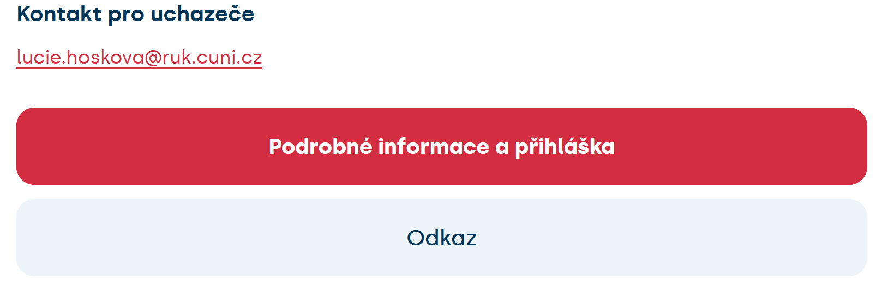
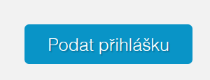
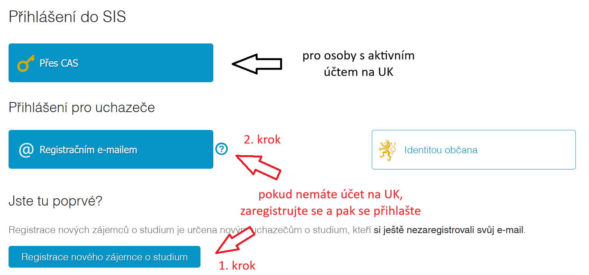
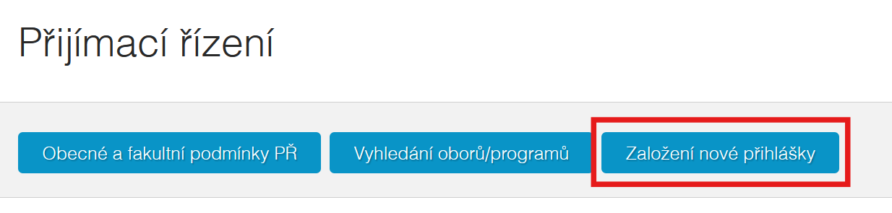
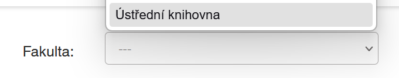
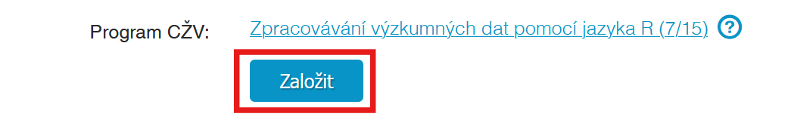

Schopnost používat počítačový software či skriptovací jazyky pro potřebu analýzy dat patří v současné době k nutnému repertoáru znalostí vědeckých a akademických pracovníků. V rámci tohoto kurzu se naučíte zpracovávat svá výzkumná data pomocí open source jazyka R v prostředí programu RStudio.

::: callout-warning
## Kapacity naplněny

**Kapacity na tento běh kurzu jsou již naplněny, přihlášení do dalšího běhu kurzu se znovu spustí během příštího semestru.**

**Pokud chcete být o spuštění informováni, kontaktujte mě na [lucie.hoskova\@ruk.cuni.cz](mailto:lucie.hoskova@ruk.cuni.cz "e-mailová adresa").**
:::

::: callout-note
## odkaz na registraci

Na kurz se přihlašuje skrz portál Centra pro celoživotní vzdělávání UK dostupném [**zde**](https://celozivotni.cuni.cz/vyhledavac-programu?program=12878)**. Podrobný návod provádějící postupem registrace naleznete na** [Návod na přihlášení]**.**
:::

### Cíl kurzu 

Cílem kurzu je vybavit účastníky praktickými dovednostmi pro efektivní práci s daty v prostředí R a RStudia tak, aby dokázali samostatně zpracovávat, analyzovat a prezentovat výsledky svých výzkumů. Naučí se systematicky organizovat projekty, připravit a transformovat data do podoby vhodné pro vizualizaci a analýzu. Součástí je i rozvoj schopnosti kriticky vybírat a používat statistické a vizualizační metody, interpretovat jejich výstupy a zohledňovat limity jednotlivých postupů. Absolventi kurzu tak budou schopni aplikovat R ve vlastní výzkumné praxi, posílit kvalitu svých analýz a zvýšit jejich transparentnost i důvěryhodnost. 

### Náplň lekcí

Kurz je koncipován jako série deseti obsahově na sebe navazujících přednášek. Obsah je rozdělen na tři sekce:

-   **úvod do R a příprava dat pro následující analýzu**
-   **vizualizace dat,**
-   **statistická analýza**.

Přehled náplně jednotlivých lekcí se nachází v [sylabu](https://luc-hoskova.github.io/introR_CUNI/sylabus.html) kurzu.

## Komu je kurz určen?

Teto kurz je cílen především na osoby, které se věnují analýze výzkumných dat. Může se jednat jak o akademiky a jiné výzkumníky a výzkumnice, ale také o vědeckou podporu; osoby, které pomáhají těmto osobám pracovat s jejich daty (například data stewardi).

Určen je převážně pro osoby, které jsou již aktivně součástí pracovního procesu, a nemohou si tak dovolit docházet každý týden na kratší lekce uprostřed dne.

## Podmínky pro úspěšné dokončení kurzu a získání mikrocertifikátu

Pro získání mikrocertifikátu je potřeba splnit následující podmínky:

1.  alespoň 80% docházka
2.  odevzdané průběžné domácí úkoly
3.  vypracování závěrečného projektu

V případě nemoci či jiné neočekávané situace, která by způsobila dlouhodobou nepřítomnost, bude zajištěna individuální náhrada výuky.

## Místo a čas výuky

Výuka bude probíhat **každé druhé úterý** v měsící v průběhu podzimního semestru (**půlka** **září až začátek února**). Termíny jednotlivých lekcí jsou vypsány v [sylabu](https://luc-hoskova.github.io/introR_CUNI/sylabus.html).

Čas výuky je **09:00-12:00** (včetně přestávek).

Výuka je **pouze v prezenční formě** a odehrává se v prostorách **Ústřední Knihovny UK**.

::: callout-note
## Ústřední knihovna se nachází v druhém patře Hotelu Krystal.
:::

> učebna 216\
> José Martího 407\
> Ústřední Knihovna UK\
> Praha

Učebna má k dispozici náhradní notebooky v případě potřeby výjimečného zapůjčení během lekce.

## Návod na přihlášení

**1)** Na [stránce kurzu](https://celozivotni.cuni.cz/vyhledavac-programu?program=12878) vyberte „Podrobné informace a přihláška“.

{width="423"}

**2)** Sjeďte dolů po stránce "[Detail programu s mikrocertifikátem](https://is.cuni.cz/studium/prijimacky/index.php?do=detail_kurz_mc&cid=12878)" a po přečtení informací o kurzu klikněte na „podat přihlášku“.

**3)** Přihlašte se do systému. Pokud jste zaměstnanci či studenti UK, použijte přihlašovací systém CAS. Jinak je třeba, abyste si zaregistrovali e-mail a až poté se přihlásili.

{width="605"}

**4)** Po přihlášení se Vám zobrazí stránka Přijímací řízení“. Klikněte na „Založení nové přihlášky“.

{width="414"}

**5)** V seznamu fakult vyberte Ústřední knihovnu.

{width="412"}

**6)** Vyberte kurz.

{width="413"}

**7)** Vyplňte a odešlete přihlášku.
