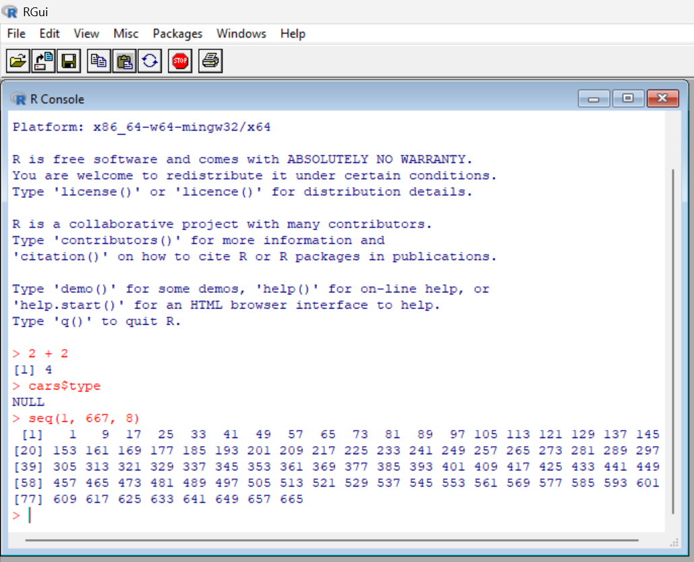
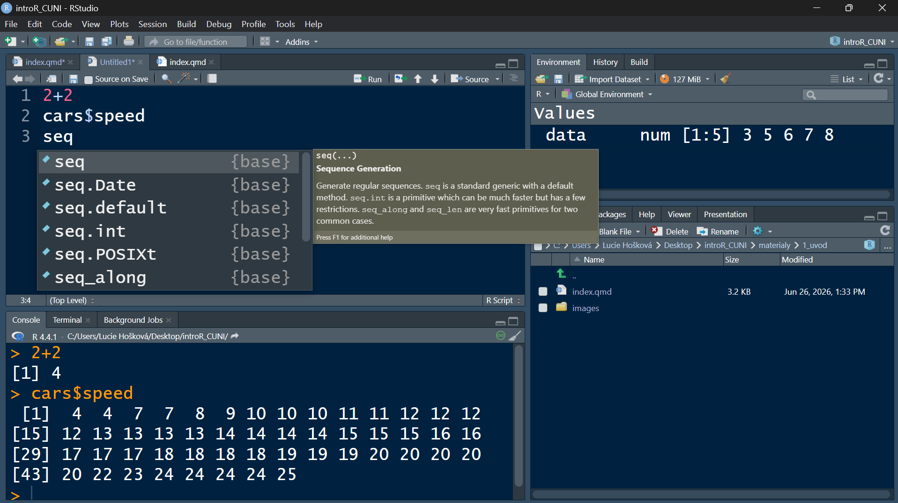
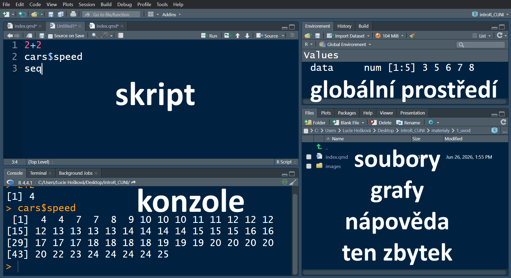
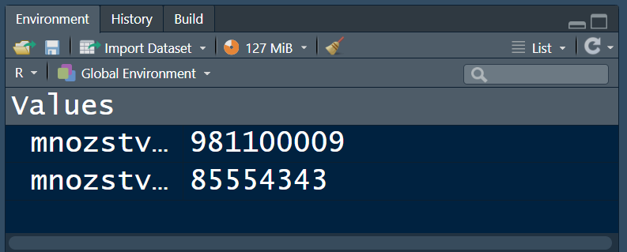
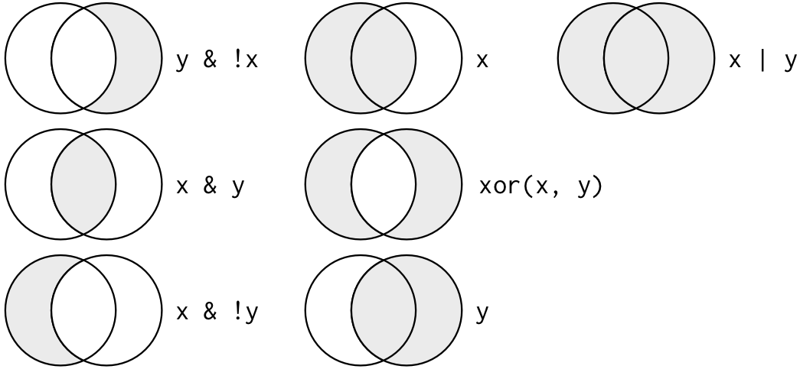

## Program

::: incremental
- organizační a administrativní informace ke kurzu
- krátké seznamovací okénko
- seznámení se s prostředí IDE RStudio
- datové typy v R
- ukládání dat do proměnných
- operátory
- etiketa psaní kódu
- working directory
- RProjekty, .RData
- funkce v R a jejich syntax
:::

## O kurzu

- kurz s cílem poskytnout účastníkům **solidní základy práce s R** za účelem následné práce s vědeckými daty

- **zakončení mikrocerfikátem**: oficiální [certifikát uznávaný napříč EU](https://cczv.cuni.cz/CCZV-521.html) s jasně definovanými dovednostmi

- pokračování: do budoucna jsou plánována **jednorázová školení na specifická pokročilá témata** o která bude zájem

## O vyučujícím

#### Mgr. Lucie Hošková

- manažer repozitáře pro výzkumná data na UK

- výuka R v rámci programu Charleston, Letní školy pro data stewardy, a akcí pod záštitou CpOS

- datová práce všeho druhu

  - datová analýza pro Akademii Věd

  - konzultace pro dizertační, diplomové a bakalářské práce

  - KPZ (kolega poslední záchrany)

- popularizačně naučné přednášky nejen o datové analýze

## Organizace kurzu

- **10 lekcí po třech hodinách**
  - bloky 3 x cca 50 minut
  - výuka jednou za dva týdny, přes Vánoce pauza
- **3 tématické okruhy**
  - zpracovávání dat
  - vizualizace dat
  - analýza dat

## Hodnocení kurzu

1.  **průběžné domácí úkoly**
2.  **miniprojekt přes Vánoce**
3.  **80% docházka**
    - v případě nemoci/neschopnosti se účastnit prezenčně možnost připojení online, ale **prosím choďte pokud můžete**
    - v případě absence či online výuky domácí práce navíc
    - je to vše o domluvě :\]

## Průběh hodin

1.  úvodní opakování z předchozí hodiny

2.  výklad nové látky

    - kombinace prezentace, code-along a samostatné práce

3.  cvičení z probrané látky

    - kombinace nové látky a znalostí z předchozích hodin

4.  řešení "chuťovek" z minulých hodin a z dotazů

5.  zadání domácího úkolu

## Práce s materiály

Před každou hodinou (maximálně pondělí ráno daného týdne) bude **do výukových materiálů nahrána prezentace k dané lekci, stejně tak veškerá potřebná data.**

Pokud bude potřeba abyste si pro práci v hodině nějaká data stáhli, učiňte tak prosím a **uložte si je do dedikované složky** na vašem počítači.

Doporučuji **mít prezentaci během hodiny otevřenou** pro nahlížení a kopírování kódu.

Pokud si chcete psát ruční poznámky, zmáčknutí "e" a poté tisk obrazovky vám umožní vytisknout si snímky prezentace v PDF.

# Představovací kolečko

1.  jméno

2.  obor

3.  zkušenosti s programováním (potažmo R)

4.  zkušenosti se statistikou

5.  co se chcete naučit

## Programovací jazyk R

**Open source** programovací jazyk určený ke statistické analýze a datové vizualizaci.

- v současnosti jeden ze **standardů pro datovou analýzu ve vědecké sféře**

- aktivně využívaný, spravovaný a uržovaný **globální vědeckou komunitou**

  - dlouhá historie: spuštěn v roce 1993

- nepřeberné množství specializovaných rozšíření

## R vs RStudio

::::: columns
::: {.column width="50%"}
R


:::

::: {.column width="50%"}
RStudio



- IDE - vývojářské prostředí

- usnadňuje práci s R
:::
:::::

## RStudio



------------------------------------------------------------------------

**Skript:** místo pro psaní kódu

**Konzole:** samotné R, místo výpočtů a zobrazování výsledků či chybových hlášek

**Terminal:** psaní přímo do příkazové řádky

**Globální prostředí:** přehled uložených proměných

**History:** historie spuštěného kódu

**Files:** soubory v daném adresáři se kterými R může pracovat

**Plots:** místo pro zobrazování grafů

**Packages:** plug-iny pro R

**Help:** nápověda

## Datové typy v R

:::::: columns
::: {.column width="33%"}
### Numeric

- integer

  - 5, 0, 123

- double

  - 1.87, 0.3679

  - Inf

  - -Inf
:::

::: {.column width="33%"}
### Character

- "Hello world!"
- "žluťoučký"
- "532"
- 'kolo'
:::

::: {.column width="33%"}
### Logical

- taktéž popisovány jako boolean

- TRUE

- FALSE
:::
::::::

------------------------------------------------------------------------

### Další typy se kterými se můžete setkat

::::: columns
::: {.column width="50%"}
NA

```{r}
vektor <- 1:4
vektor[5]
```

Complex

```{r}
as.complex(5.75 * sqrt(65))
```
:::

::: {.column width="50%"}
NULL

```{r}
radaCisel <- c(1, 2, NULL, 4)
radaCisel
```

NaN

```{r}
0 / 0
```
:::
:::::

- Přestože s komplexním číslem můžeme provádět aritmetické operace, R jej nebere jako numeric hodnotu!

- NaN je naopak bráno jako numeric hodnota

## Ukládání proměnných

R umožňuje uložit si informace pomocí proměnných.

Místo toho, abyste poté museli informaci znovu definovat, tak si můžete zavolat proměnnou.

```{r}
mnozstviZkumavek <- 85554343
mnozstviKadinek <- 981100009

mnozstviZkumavek + mnozstviKadinek
```

Uložené proměnné jsou vždy vypsané v globálním prostředí.

{fig-align="center"}

------------------------------------------------------------------------

Hodnota se uloží pomocí následujícího postupu:

**název proměnné \<- hodnota**

- R čte zpravidla zleva do prava, proto je možné i hodnota -\> proměnná

  - silně nedoporučuji, je to nepřehledné

```{r}
123456789123456789123456789123456789 -> cisloNaruby
cisloPoradne <- 123456789123456789123456789123456789 
```

**Jaké proměnné mám uložené v globálním prostředí?**

Seznam proměnných, které jsou v R uložené a se kterými můžete pracovat, naleznete buď v poli Environment v pravém horním rohu.

Můžete také ale využít funkce `objects()`. Ta do konzole vypíše seznam všech uložených hodnot.

Totožný výsledek získáte i pomocí funkce `ls().`

------------------------------------------------------------------------

**Je možné přepsat hodnoty?**

Ano, pokud uděláte chybu v zápise či potřebujete změnit specifickou proměnnou či její část, není třeba ji mazat - stačí ji přepsat.

```{webr}
promennaSpatne <- "4"
promennaSpatne + 5
```

**Co když chci hodnotu ale i tak smazat?**

Funkce `rm()` umožňuje mazat uložené proměnné z globálního prostředí.

- `rm()` - smaže VŠE

- `rm(název proměnné)` - smaže specifickou proměnnou

------------------------------------------------------------------------

### Zakázané způsoby pojmenovávání proměnných

- mezera mezi slovy

  ``` r
  pet aut <- 5
  ```

- začínat symbolem

  ``` r
  <6>4aut <- 5
  ```

- začínat číslicí

  ``` r
  5aut <- 5
  ```

  **Pozor na diakritiku!**

## Procvičení

Ulož do proměnné x číslo, do y text a do z boolean.

```{webr}
#| exercise: ex_1
x ______
y ______
z ______

x
y; z #strednik oddeluje prikazy
```

Jaký bude výsledek následujícího kódu?

```{webr}
#| exercise: ex_2
a <- "5"
b <- 6
a + b
```

Jaký bude výsledek následujícího kódu?

```{webr}
#| exercise: ex_3
text <- ahoj!

text
```

## Operátory

### Matematické operátory

\+ - sčítání a odčítání

```{r}
5 + 7
8 - 2
```

**\*** násobení

```{r}
10 * 7
```

**/** dělení

```{r}
10 / 5
```

**%%** zbytek po dělení

```{r}
10 %% 7
10 %% 5
```

**%/%** dělení bez zbytku

```{r}
10 %/% 7
10 %/% 5
```

**\*\*** nebo **\^** umocnění

```{r}
5 ^ 2
5 ** 2
```

**\<= \>=** menší/větší nebo rovno

```{r}
8 >= 8
5699 <= 3456
```

------------------------------------------------------------------------

### Logické operátory

Logické operátory lze použít při výběru (vyber x NEBO y, x A y) či spojování podmínek, ale také umí vracet boolean hodnoty.

**&** a, taktéž, zároveň

```{r}
#zkontroluj, jestli plati oba vyrazy
34 > 44 & 56 > 8
34 < 44 & 56 > 8
```

**\|** nebo

```{r}
#jsou hodnoty v z nizsi nez 7 nebo vyssi nez 25
z <- c(13, 87, 2, 23)
(z < 7) | (z > 25)
```

**%in%** je v, nachází se v

```{r}
hodnoty <- c(12, 87, 55, 1098)
55 %in% hodnoty
345 %in% hodnoty
```

**==** je přesně

```{r}
x <- 5
x == 6
x == 5
```

**!** není, not, negace

```{r}
!TRUE
x <- 3
!(x == 4)
```

------------------------------------------------------------------------

{fig-align="center"}

## Procvičení

Jaký zbytek nám zbyde po vydělení násobku devíti a desíti číslem čtyři?

```{webr}
#| exercise: ex_1
```

Jaký bude výsledek tohoto výpočtu?

```{webr}
#| exercise: ex_2
6 ^ 2 - 3 * 5
```

Na dopravní hřiště mohou pouze děti ve věku 15+, mladší pouze s povolením rodičů. Může toto dítě na hřiště?

```{webr}
#| exercise: ex_3
vek <- 13
povoleni <- FALSE
```

------------------------------------------------------------------------

## Samostatné cvičení

1.  Frantovi je 53 let. Chce si koupit jízdenku, u které je možnost slevy pro seniory 65+ či děti a studenty až do 26 let včetně.\
    Ověř, zda má Franta na tuto slevu nárok.

2.  Studentstvo může získat stipendium za následujících podmínek: mají průměr známek menší než 1.8 a zároveň absolvovali alespoň 80 % docházky, nebo reprezentují školu na soutěžích.\
    Saša má průměr 1.7, zameškáno 3 hodin z 10 a pravidelně vyhrává biologickou olympiádu.\
    Zjisti, zda má Saša právo na stipendium.

3.  Uzavírají se známky na konci semestru. Zápočet dostanou pouze ti, kteří mají dosavadní hodnocení na lepším stupni než 5 a v posledním testu získali jiný počet než nula bodů. Pokud tyto podmínky nesplňují, tak zápočet mohou dostat i tehdy pokud vypracovali seminární práci navíc a v písemce měli alespoň 50 bodů.\
    Julie má dosavadní hodnocení sice na 5, aní písemka se jí nepovedla a měla pouze 17 bodů. Napsala ale velmi povedenou semestrální práci na téma kyberbezpečnosti ve Vietnamu.\
    Dostane Julie zápočet?

```{r}
#| echo: false
countdown::countdown(minutes = 15,
                     seconds = 0,
                     start_immediately = FALSE,
                     warn_when = 120,
                     top = "0")
```

## Etiketa psaní kódu

**R je case sensitive!**

```{r}
identical("data", "Data")
```

::::: columns
::: {.column width="50%"}
Používejte co chcete ale buďte konzistentní.

Který styl se vám používá nejsnadněji? U kterého děláte nejvíc chyb?

Jaké jsou zvysklosti ve vašem oboru/laboratoři?
:::

::: {.column width="50%"}
**Možné styly zápisu:**

- camelCase

- PascalCase

- snake_case

- kebab-dash

- a jiné
:::
:::::

------------------------------------------------------------------------

{fig-align="center"}

------------------------------------------------------------------------

### Poznámky

\# vše co je za hash symbolem počítač ignoruje

```{r}
2 + 1 + 3
2 + 1 # + 3
```

**Ctrl + Shift + C** po výběru více linek kódu je všechny přemění na komentář.

Pište si poznámky, ale zase to **nepřežeňte** - není to román.

```{r}
#VYPOCET PRUMERNE VYSKY 
#nahodny vyber peti reprezentantu z kazde tridy
ctvrtaTrida <- c(154, 155, 143, 156)
pataTrida <- c(171, 158, 162, 144)
mean(c(ctvrtaTrida, pataTrida)) #prumerna vyska obou trid v cm
```

## Working directory

Pokud chcete v skriptu načíst datasety a pak s nimi pracovat, **je potřeba mít určené, z jaké složky má R datasety tahat - v jakém prostředí se R pohybuje**.

Nastavení je možné buď skrz Session \> Set working directory a nebo skrz `setwd()` funkci.

::: callout-caution
Pozor, při použití `setwd()` funkce je **třeba nadefinovat přesně cestu v počítači (absolutní cestu)** jak se má R ke složce dostat!
:::

V jaké složce se nyní pohybujete lze zjistit pomocí funkce `getwd()`.

```{r}
getwd() #ukazka abolutni cesty
```

Nastavení pracovního adresáře ovlivňuje i další funkcionality R. Například, **při ukládání skriptů se automaticky vybere** jako možnost uložení právě složka pracovního adresáře.

------------------------------------------------------------------------

### S jakými soubory mohu pracovat?

Seznam souborů které má v nastaveném adresáři R dosupné naleznete bud' v okně **Files**, nebo pomocí funkce `list.files()`.

```{r}
list.files()
```

Jak vidíte, soubor nám vypíše dostupné soubory a složky v nastaveném pracovním adresáři. Co když se ale v něm chci podívat co je uvnitř specifické složky? K tomu je **potřeba ve funkci definovat nejenom název složky, ale i to, kde se tato složka nachází**.

```{r}
list.files("./images")
```

::: callout-tip
## Co znamená tečka v ./images?

`./`v kódu určuje, že se složka images nachází přímo v námi určeném pracovním adresáři.

Jedná se o takzvanou **relativní cestu** - k tomu si řekneme něco víc v sekci [Absolutní vs. relativní cesta].
:::

------------------------------------------------------------------------

#### Proč zapisujeme cestu ke složce jako textový řetězec, nikoliv jako čisté jméno? Třeba `list.files(./images)`?

::: fragment
Co znamená text, kolem kterého nejsou uvozovky?
:::

::: fragment
**Text, kolem kterého nejsou uvozovky značí proměnnou** (a nebo funkci či její argument, ale k tomu příště).

**R potřebuje znát popis specifické cesty k dané složce**. A jelikož popisek je ve své podstatě textový řetezec, musíme ho mít v uvozovkách - tak se v R označuje text.
:::

------------------------------------------------------------------------

#### Absolutní vs. relativní cesta

##### absolutní cesta:

`"C:/Users/Jana/Desktop/vyzkum/M433/data/pribice.csv"`

##### relativní cesta při nastaveném working directory v M433:

`"./data/pribice.csv"`

Relativní cesta odkazuje na **soubor uvnitř specifického pracovního adresáře**, nikoliv přímo na místo v počítači jako absolutní cesta.

Doporučuji absolutní cestu když už používat, tak pouze při nastavování `setwd()`. Sice lze teoreticky nahrávat soubory a provádět jiné akce uvnitř pracovního adresáře i pomocí absolutní cesty, ale **jakmile by se například složka ve které se pracuje kamkoliv posunula, tak by absolutní cesta přestala fungovat.**

## Samotné cvičení

```{r}
#| echo: false
countdown::countdown(minutes = 5,
                     seconds = 0,
                     start_immediately = FALSE,
                     warn_when = 120,
                     top = "0")
```

1.  Vytvořte si složku s jménem **pokusnaSlozka** na náhodném místě ve svém počítači. Zkuste si sami pomocí funkce `setwd()`a absolutní cesty ručně nastavit pracovní adresář do této lokace.

2.  Vytvořte si v pokusnaSlozka sérii podsložek, třeba až do třetí či páté úrovně (složka x ve složce y co je ve složce z...) a do finální z nich si nahrajte několik náhodných souborů. **Vypište jejich seznam pomocí funkce `list.files()`.**

## RProjekty

Co kdybychom chtěli, aby se nám všechny naše skripty a jejich výsledky automaticky ukládaly do a tahaly rovnou z **jednoho specifického adresáře** bez potřeby ho při každém otevření RStudia nastavovat, a který bychom navíc mohli jednoduše vzít a přesunout či ho někomu zazipovaný poslat?

Toho můžete docílit pomocí vytvoření **RProjektu**.

RProjekt vytvoří "izolované" prostředí, kdy všechny vaše soubory uvnitř tohoto adresáře budou svázané dohromady, budou se vám **automaticky znovu nahrávat uložené proměnné** bez nutnosti opakovaného spouštění kódu, a hlavně k nim vždy bude **relativní, nikoliv absolutní cesta** = celý projekt si můžete přesouvat mezi složkami či počítači bez potřeby nastavování working directory.

## Nahrávání uložených proměnných

V základním nastavení RProjekty **automaticky ukládají a následně nahrávají uložené proměnné zpět do globálního prostředí**. Není proto potřeba při každém otevření projektu v RStudiu celý skript projíždět znovu a všechno znovu nahrávat. Je ovšem možné si uložit vybranné proměnné i ručně.

```{r}
typVozidla <- "automobil"
pocetVozidel <- 6
jmenoModelu <- "škoda octavia"
save(typVozidla, pocetVozidel, jmenoModelu, file = "vozidla.RData")
```

**Objekt RData v sobě obsahuje informace o jednotlivých proměnných.** Do globálního prostředí se nahrají funcí `load()`.

```{r}
load("vozidla.RData")
```

Můžete svým kolegům tak například poslat již vyčištěná a připravená data, bez toho aby si sami museli nahrávat původní tabulku a provádět na ní veškeré kontroly.

## Funkce v R

Nedílnou součástí kódu v R jsou takzvané funkce. Jedná se o **příkazy, které provedou specifickou akci za vámi definovaných podmínek**.

`název funkce(název argumentu = parametry argumentu)`

Pomocí funkce `seq` vygeneruj sekvenci s rozestupem po 3 od 10 do 20.

```{r}
seq(from = 10, to = 20, by = 3)
```

::: fragment
Co bude výsledkem následujícího kódu?

```{webr}
seq(from = 2, to = 10, length.out = 5)
```
:::

------------------------------------------------------------------------

### Lze psát příkazy i bez definování argumentů?

```{r}
rep("ID", 5)
```

::: fragment
Ano; bez definování názvu argumentu se pracuje s jeho pořadím.
:::

::: fragment
Je pořadí argumentů důležité? Ovlivní výsledek?

```{webr}
rep(x = "vzorek", times = 10)
```

```{webr}
rep(times = 10, x = "vzorek")
```
:::

:::: fragment
::: callout-caution
## Pozor!

Na pořadí argumentu nezáleží, dokud jasně **definujeme k jakému argumentu parametr patří**.
:::
::::

::: fragment
Jaký bude výsledek těchto kódů? Jsou totožné?

```{webr}
seq(10, 6)
seq(to = 10, from = 6)
```
:::

------------------------------------------------------------------------

### Rozdíl mezi `=` a `<-`

Možná jste se setkali s tím, že někdo zapisuje proměnné pomocí operátoru =. Funguje to?

```{r}
x = 6
x + 1
```

Proč se proto místo toho používá `<-` ?

```{r}
rep(osobaID <- 5, 3)
osobaID + 4
```

:::: fragment
::: callout-tip
## R umožňuje provádět akce uvnitř "jiných akcí"

V tomto případě určujeme argument na první pozici, a zároveň jeho hodnotu ukládáme do proměnné `osobaID`.
:::
::::

------------------------------------------------------------------------

Co bude výsledkem následujícího kódu?

```{webr}
rep(osobaID_2 = 5, 3)
osobaID_2 + 4
```

::: fragment
Na jaké problémy zde narazíme?
:::

::: incremental
- `osobaID` není argument funce `rep`

- operátor `=` ve funkci neznamená přiřazení, ale určení argumentu

  - samotný argument `osobaID_2` ve funkci `rep` neexistuje a proto nevznikne platný výsledek

- nedošlo k zapsání do globálního prostředí a tuto neexistující proměnnou proto nelze používat
:::

------------------------------------------------------------------------

### Samostatné cvičení

1.  Múžeme zapsat sekvenci od 1 do 10 s počtem hodnot 3 pomocí následujícího kódu? Pokud ne, opravte.

    ```{webr-r}
    seq(1, 10, 3)
    ```

2.  Bez spuštění kódu určete, jaký bude výsledek této funkce. Používejte nápovědu, zkuste si jednotlivé části rozepsat.

    ```{webr-r}
    length(rep(seq(2, 10, 2), 3))
    ```

```{r}
#| echo: false
countdown::countdown(minutes = 5,
                     seconds = 0,
                     start_immediately = FALSE,
                     warn_when = 120,
                     top = "0")
```

------------------------------------------------------------------------

#### Řešení úlohy 1)

Múžeme zapsat sekvenci od 1 do 10 s počtem hodnot 3 pomocí následujícího kódu? Pokud ne, opravte.

```{webr-r}
seq(1, 10, 3)
```

:::: fragment
Ne, jelikož argument na třetí pozici v této funkci není `length.out`, který určuje délku sekvence, ale `by`, který určuje periodu.

::: callout-important
## Čtěte dokumentaci pozorně!

R dokumentace je psana mnoha lidmi a nemusí být vždy konzistentní.
:::
::::

::: fragment
Správná podoba kódu by tedy byla

```{r}
seq(from = 1, to = 10, length.out = 3)
```
:::

------------------------------------------------------------------------

#### Řešení úlohy 2)

Bez spuštění následujícího kódu určete, jaký bude výsledek této funkce. Používejte nápovědu, zkuste si jednotlivé části rozepsat.

```{webr-r}
length(rep(seq(2, 10, 2), 3))
```

::: fragment
Funkce `length` zjišťuje, jaká je "délka", jaký je počet hodnot. Potřebujeme proto spočítat, kolik hodnot nám vznikne jako výsledek funkce `rep`.
:::

::: fragment
Funkce `rep` nám zde třikrát zopakuje výsledek daný funkcí `seq`.
:::

::: fragment
Funkce `seq(2, 10, 2)` by zde mohla být zapsána na základě pořádí argumentů i jako `seq(from = 2, to = 10, by = 2)`. Výsledkem je tak sekvence `2  4  6  8 10`, která má pět čísel.
:::

::: fragment
Třikrát se tedy zopakuje sekvence pěti čísel, což znamená že **výsledek je patnáct**.
:::

## Vnořování funkcí

Jak bylo vidět v přechozích částech, R umožňuje používat funkce uvnitř dalších funkcí.

Pro R je hlavně důležité, aby **hodnoty v jednotlivých argumentech splňovaly jejich podmínky, nikoliv v jaké podobě tyto hodnoty do funkce vstupují**.

```{r}
trojka <- 3
rep(x = seq(1, 10, 3), times = trojka)
```

------------------------------------------------------------------------

V určité chvíli je ovšem dobré **přemýšlet i o čitelnosti samotného kódu**.

Který z následujících kódů je čitelnější?

```{r}
sample(x = rep(x = seq(1, 10, 3), times = 2), size = 4, replace = FALSE)
```

nebo

```{r}
opakovani <- rep(x = seq(1, 10, 3), times = 2)

sample(x = opakovani, size = 4, replace = FALSE)
```

## Domácí práce

1.  Vytvořte RProjekt

2.  Nahrajte do globálního prostředí proměnné z `promenne.RData`

3.  Zjistěte, kolik zaměstnanců lze z rozpočtu platit po uvedenou dobu měsíců

    plat = jaký je plat jednoho zaměstnance za jeden měsíc\
    pocetMesicu = kolik měsíců je potřeba všechny zaměstnance platit\
    rozpocet = jaký finanční rozpočet máte na dobu pocetMesicu k dispozici

4.  RProjekt s výpočtem zašlete nejpozději do pátku před příští hodinou na [lucie.hoskova\@ruk.cuni.cz](mailto:lucie.hoskova@ruk.cuni.cz)

## Příprava na další hodinu

Nainstalujte si balíček [`tidyverse`](https://tidyverse.org/packages/). Počítejte s tím, že balíček se bude stahovat a instalovat klidně i **několik desítek minut**.
