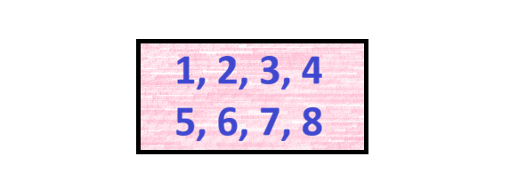
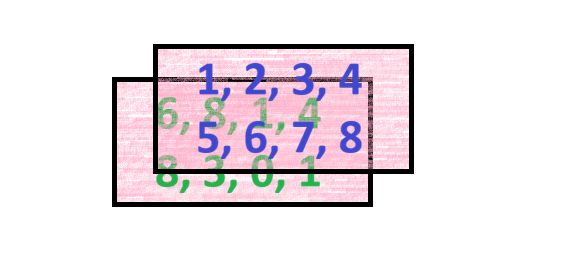

## Program

::: incremental
-   opakování z minulé hodiny
-   kontrola domácího úkolu
-   funkce v R a jejich syntax
-   datové struktury v R
    -   vektor
    -   pole
    -   matice
    -   list
    -   data frame
    -   tibble
-   indexace
:::

## Kontrola domácí práce

::: incremental
1.  vytvoření RProjektu

2.  nový R skript

3.  nahrání uložených dat

    ```{r}
    load("promenne.RData")
    ```

    Jde nahrát RData soubor i jiným způsobem? Jaké jsou nevýhody tohoto přístupu?

4.  výpočet toho, kolik zaměstnanců s daným platem jde nabrat na specifikovanou dobu měsíců

    ```{r}
    (rozpocet%/%plat)/pocetMesicu
    ```

5.  A nešlo by to jinak?

    ```{r}
    identical((rozpocet%/%plat)/pocetMesicu, (rozpocet/plat)%/%pocetMesicu)
    ```
:::

## Funkce v R

Nedílnou součástí kódu v R jsou takzvané funkce. Jedná se o **příkazy, které provedou specifickou akci za vámi definovaných podmínek**.

`název funkce(název argumentu = parametry argumentu)`

Pomocí funkce `seq` vygeneruj sekvenci s rozestupem po 3 od 10 do 20.

```{r}
seq(from = 10, to = 20, by = 3)
```

::: fragment
Co bude výsledkem následujícího kódu?

```{webr}
seq(from = 2, to = 10, length.out = 5)
```
:::

------------------------------------------------------------------------

### Lze psát příkazy i bez definování argumentů?

```{r}
rep("ID", 5)
```

::: fragment
Ano; bez definování názvu argumentu se pracuje s jeho pořadím.
:::

::: fragment
Je pořadí argumentů důležité? Ovlivní výsledek?

```{webr}
rep(x = "vzorek", times = 10)
```

```{webr}
rep(times = 10, x = "vzorek")
```
:::

::: fragment
::: callout-caution
## Pozor!

Na pořadí argumentu nezáleží, dokud jasně **definujeme k jakému argumentu parametr patří**.
:::
:::

::: fragment
Jaký bude výsledek těchto kódů? Jsou totožné?

```{webr}
rep(10, "vzorek")
rep(times = 10, x = "vzorek")
```
:::

## Rozdíl mezi `=` a `<-`

Možná jste se setkali s tím, že někdo zapisuje proměnné pomocí operátoru =. Funguje to?

```{r}
x = 6
x + 1
```

Proč se proto místo toho používá `<-` ?

```{r}
rep(osobaID <- 5, 3)
osobaID + 4
```

::: fragment
::: callout-tip
## R umožňuje provádět akce uvnitř "jiných akcí"

V tomto případě určujeme argument na první pozici, a zároveň jeho hodnotu ukládáme do proměnné `osobaID`.
:::
:::

------------------------------------------------------------------------

Co bude výsledkem následujícího kódu?

```{webr}
rep(osobaID_2 = 5, 3)
osobaID_2 + 4
```

::: fragment
Na jaké problémy zde narazíme?
:::

::: incremental
-   `osobaID` není argument funce `rep`

-   operátor `=` ve funkci neznamená přiřazení, ale určení argumentu

-   nedošlo k zapsání do globálního prostředí a tuto neexistující proměnnou proto nelze používat
:::

## Samostatné cvičení

1.  Mohu zapsat sekvenci od 1 do 10 s počtem hodnot 3 pomocí následujícího kódu? Pokud ne, opravte?

    ```{webr}
    seq(1, 10, 3)
    ```

2.  Bez spuštění kódu určete, jaký bude výsledek této funkce. Používejte nápovědu, zkuste si jednotlivé části rozepsat.

    ```{webr}
    length(rep(seq(2, 10, 2), 3))
    ```

```{r}
#| echo: false
countdown::countdown(minutes = 5,
                     seconds = 0,
                     start_immediately = FALSE,
                     warn_when = 120,
                     top = "0")
```

------------------------------------------------------------------------

1.  Mohu zapsat sekvenci od 1 do 10 s počtem hodnot 3 pomocí následujícího kódu?

```{r}
seq(1, 10, 3)
```

::: fragment
Ne, jelikož argument na třetí pozici v této funkci není `length.out`, který určuje délku sekvence, ale `by`, který určuje periodu.

V tomto případě určujeme argument na první pozici, a zároveň jeho hodnotu ukládáme do proměnné `osobaID`.

::: callout-important
## Čtěte dokumentaci pozorně!

R dokumentace je psana mnoha lidmi a nemusí být vždy konzistentní.
:::
:::

------------------------------------------------------------------------

2.  Bez spuštění kódu určete, jaký bude výsledek této funkce. Používejte nápovědu, zkuste si jednotlivé části rozepsat.

```{r}
length(rep(seq(2, 10, 2), 3))
```

::: fragment
Funkce `length` zjišťuje, jaká je "délka", jaký je počet hodnot. Potřebujeme proto spočítat, kolik hodnot nám vznikne jako výsledek funkce `rep`.
:::

::: fragment
Funkce `rep` nám zde třikrát zopakuje výsledek daný funkcí `seq`.
:::

::: fragment
Funkce `seq(2, 10, 2)` by zde mohla být zapsána na základě pořádí argumentů i jako `seq(from = 2, to = 10, by = 2)`. Výsledkem je tak sekvence `2  4  6  8 10`, která má pět čísel.
:::

::: fragment
Třikrát se tedy zopakuje sekvence pěti čísel, což znamená že **výsledek je patnáct**.
:::

## Vnořování funkcí

Jak bylo vidět v přechozích částech, R umožňuje používat funkce uvnitř dalších funkcí.

Pro R je hlavně důležité, aby **hodnoty v jednotlivých argumentech splňovaly jejich podmínky, nikoliv v jaké podobě tyto hodnoty do funkce vstupují**.

```{r}
trojka <- 3
rep(x = seq(1, 10, 3), times = trojka)
```

------------------------------------------------------------------------

V určité chvíli je ovšem dobré **přemýšlet i o čitelnosti samotného kódu**.

Který z následujících kódů je čitelnější?

```{r}
sample(x = rep(x = seq(1, 10, 3), times = 2), size = 4, replace = FALSE)
```

nebo

```{r}
opakovani <- rep(x = seq(1, 10, 3), times = 2)

sample(x = opakovani, size = 4, replace = FALSE)
```

## Datové struktury v R

### Vektor

> **série za sebou jdoucích hodnot totožného datového typu**

-   vektor o jedné hodnotě je někdy nazýván *atomický vektor* či *skalár*

-   jednodimenzionální (důležité hlavně při vyhledávání)

-   při použití více datových typů dochází k nucené konverzi do jednotného typu

```{r}
seq(1, 10, 2)
```

------------------------------------------------------------------------

#### Jakými jinými způsoby můžeme vektory vytvořit?

-   symbol `:` vytvoří sérii čísel v daných mezích

    -   rozestup vždy po jedné

```{r}
-5:3
0.65:9.18
```

-   funkce `c` spojí hodnoty jakéhokoliv typu do vektoru

```{r}
c("jmeno", "prijmeni")
c(1, 5, 77)
```

-   **způsobů je mnohem více**, tyto se ale hodí znát

## Potenciální zádrhely

Co se stane po projetí následujícího kódu?

```{webr-r}
c(6, TRUE, 2:6, "osm", 7)
```

::: fragment
Datový typ vektoru bude **automaticky převeden na charakterový**, jelikož vektor v sobě **kombinuje několik datatypů** dohromady.
:::

Jaký bude datový typ následujícího vektoru?

```{r}
vektorNA <- c(NA, 6, 9)
```

::: fragment
NA označuje chybějící hodnotu, nikterak neurčuje samotný datový typ hodnoty.
:::

::: fragment
::: callout-tip
Ke zjištění datového typu je možné použít funkci `mode`.

```{r}
mode(vektorNA)
```
:::
:::

## Pojmenovávání hodnot

Jednotlivé hodnoty ve vektoru (ale i zbylých datových strukturách) je možné si pojmenovat.

```{r}
jmena <- c(jan = 22, dan = 667, sam = 6)
names(jmena) #jake pojmenovani ma danna promenna?
```

::: callout-note
## Co znamená pojmenováná?

Při pojmenovávání připojujeme specifické hodnotě či sérii hodnot určitý štítek. Nejenomže popisuje vlastnost hodnot(y), kterou pojmenovává, ale zárověň ho lze použít i k vyhledávání (indexování) jednotlivých hodnot. Více o indexování si řekneme v následující sekci.
:::

**Pojmenování není to samé co přiřazování**; nevytváříme nové objekty, pouze hodnotám přidáváme novou charakteristiku. Ukázkou toho je, že je možné jedno pojmenování používat víckrát (i když to opravdu není dobrý nápad).

```{r}
c(škoda = "octavia", škoda = "felicia", volkswagen = "beetle")
```

------------------------------------------------------------------------

### Co když si chci zpětně vektor pojmenovat?

```{r}
vektorBezJmen <- c("Škoda", "Hyundai", "Vespa"); vektorBezJmen
names(vektorBezJmen) #ma vektorBezJmen jmena?
names(vektorBezJmen) <- c("Česko", "Japonsko", "Itálie"); vektorBezJmen
names(vektorBezJmen)
```

::: callout-tip
## Přiřazováním můžete měnit existující hodnoty

**Přiřazování neslouží pouze k vytváření proměnných, může na nich provádět i změny**. Nemusí se jednat pouze o celé proměnné (které jsou pouze pojmenováním určité hodnoty či jejich skupiny) ale i specifické hodnoty uvnitř nich či hodnoty je popisující.
:::

### Samostatné cvičení

```{r}
#| echo: false
countdown::countdown(minutes = 5,
                     seconds = 0,
                     start_immediately = FALSE,
                     warn_when = 120,
                     top = "0")
```

1.  Vypište alespoň tři rozdílné způsoby, jak získat následující vektor:

    ```{webr-r}
    #| context: output
    c(1,2,3,1,2,3,9,8,7,2)
    ```

2.  Vytvořte kód který upraví následující vektor tak, aby jména jednotlivých hodnot byla napsaná malými písmeny. Existuje pro toto i specifická funkce?

    ```{r}
    id <- c(JMENO = "jan", PRIJMENI = "novak")
    ```

3.  Opravte následující kód tak, aby dával požadovaný výsledek.

    ```{webr-r}
    rep(škoda = "octavia", 2)
    ```

------------------------------------------------------------------------

Vypište alespoň tři rozdílné způsoby, jak získat následující vektor: 1 2 3 1 2 3 9 8 7 2

```{webr}

```

------------------------------------------------------------------------

Vytvořte kód který upraví následující vektor tak, aby jména jednotlivých hodnot byla napsaná malými písmeny. Existuje pro toto i specifická funkce?

```{webr}

```

::: fragment
Existuje funkce v base R `tolower()`. Co způsobí a jakým způsobem ji můžeme použít?

```{webr}

```
:::

::: fragment
**Pokud nevíte, hledejte** - spousta problémů a specifických use cases již byla dávno vyřešena a jsou k nalezení na internetu.


:::

------------------------------------------------------------------------

Opravte následující kód tak, aby dával požadovaný výsledek.

```{r}
rep(škoda = "octavia", 2)
```

::: fragment
Nesmíte zapomenout, že symbol = uvnitř funkcí značí argument. Má funkce `rep` argument škoda?
:::

::: fragment
Nic ovšem nebrání tomu opakovat vektor s již jednou pojmenovanou hodnotou:

```{r}
rep(c(škoda = "octavia"), 2)
```
:::

------------------------------------------------------------------------

### Pole (array)

> **objekt složený z vektorů stejného datového typu a délky v několika dimenzích**

-   jakým způsobem si představit dimenze?
    -   Jedna dimenze: řada hodnot
    -   Dvě dimenze: hodnoty v sloupcích a řádcích
    -   Tři dimenze: dvě tabulky se sloupci a řádky naskládané za sebe

------------------------------------------------------------------------

### Vektor

{fig-align="center"}

### Pole o dvou dimenzích (matice)

{fig-align="center"}

### Pole o třech dimenzích

{fig-align="center"}

------------------------------------------------------------------------

-   use case

```{webr-r}
#| context: output
temps <- array(
c(20,22,19,21,18,20,17,19,21,23,20,22,19,21,
18,20,17,19,16,18,17,20,19,21,18,20,17,19,
22,24,21,23,20,22,19,21,23,25,22,24,21,23),
dim = c(3, 7, 2),
dimnames = list(
město = c("Praha", "Brno", "Ostrava"),
den = paste0("den_", 1:7),
čas = c("ráno", "večer")))
temps
```

-   nejvíce nás ale bude zajímat **datové pole o dvou dimenzích - matice**

------------------------------------------------------------------------

### Matice (matrix)

> **dvojrozměrné pole**

-   dvojrozměrný objekt znamená, že už se nejedná o objekt co má pouze jednu linii hodnot jako vektor, ale že **má řádky a sloupce**

    ```{webr-r}
    #| context: output
    matrix(1:6, nrow=3, ncol=2) 
    ```

    -   číslo v hranatých závorkách značí pozici hodnoty v dané dimenzi, více si k tomu ale řekneme v sekci Indexace

-   při pokusu o vytvoření matice z více datových typů dojde stejně jako u vektoru k nucené konverzi na charakter

```{webr-r}
#| context: output
cbind(1:3, 4:6, c("jmeno", "prijmeni", "ID"))
```

------------------------------------------------------------------------

#### Tvorba matice

Matici lze vytvořit pomocí mnoha funkcí. Pokud ji chceme vytvořit celou od začátku, můžeme použít funkcí `matrix()`.

```{webr}
matrix(1:8, nrow = 2, ncol = 4) 
```

Jaký bude výsledek této funkce? Co znamenají jednotlivé argumenty?

::: fragment
Jaký bude výsledek následující funkce?

```{webr}
matrix(1:2, nrow = 2, ncol = 4) 
```
:::

------------------------------------------------------------------------

##### Co když ale chceme vytvořit matici z již existujících vektorů stejného typu a délky?

`cbind()` = spoj vektory po sloupcích (columns)

```{r}
cbind(1:3, 5:7)
```

`rbind()` = spoj vektory po řádcích (rows)

```{r}
rbind(1:3, 5:7)
```

-   Vytvoření matice po řádcích lze i u funkce `matrix()`. Jak bychom toto provedli?

::: fragment
-   Argument `byrow` je automaticky nastaven na hodnotu `FALSE`. Pro seřazení po řádcích (by row) je potřeba v matici zahrnout `byrow = TRUE`.

```{r}
matrix(1:6, nrow = 3, ncol = 2, byrow = TRUE) 
```
:::

------------------------------------------------------------------------

#### Procvičení

Vytvoř následující matici:

```{webr-r}
#| context: output
matrix(seq(6, 34, length.out = 6), 2, 3)
```

```{webr-r}

```

Vytvořte matici z následujících vektorů:

```{webr-r}
LK3 <- c("Lukáš", "Krchov", "ID_003")
HG6 <- c("Helga", "Gdovinová", "ID_006")
TM7 <- c("Tomáš", "Marný")
```

::: fragment
Nezapomeňte na existenci NA!
:::

------------------------------------------------------------------------

#### Pojmenování sloupců a řádků

Jak je vidět z předchozího cvičení, stejně jako u vektoru **můžeme pojmenovat každou z jednotlivých součástí**, totéž můžeme provést i u matic.

```{r}
matice <- matrix(1:6, 2, 3); matice
rownames(matice) #jaka jsou jmena radku
colnames(matice) #jaka jsou jmena sloupcu
```

Pokud chceme přiřadit jména ke sloupcům či řádkům, musíme tak provést přiřazením vektoru o totožné délce.

```{r}
rownames(matice) <- c("pocetMereni", "pocetProbandu")
colnames(matice) <- c("pokus1", "pokus2", "pokus3")
matice
```

------------------------------------------------------------------------

### Samostatné cvičení

```{r}
#| echo: false
countdown::countdown(minutes = 15,
                     seconds = 0,
                     start_immediately = FALSE,
                     warn_when = 120,
                     top = "0")
```

1.  Vytvořte matici, která bude mít 5 sloupců a 2 řádky a bude obsahovat prvních 10 lichých čísel. Následně připojte k matici další sloupec, tentokrát pouze s číslem 2.\
    Sloupce pojmenujte pomocí numerických a řádky pomocí charakterových hodnot.

2.  Vytvořte následující matici:

    **HARD MODE: JEDEN ŘÁDEK KÓDU NA DRUHOU ÚLOHU A ŽÁDNÉ RBIND**

```{webr-r}
#| context: output
matrix(rep(c(15:20, 37:42), 3), ncol = length(15:20),
       byrow = TRUE)
```

------------------------------------------------------------------------

#### Řešení úlohy 1)

1.  Vytvořte sekvenci lichých čísel (každé číslo objedno od 1 dále) v počtu deseti hodnot.

    ```{r}
    seq(by = 2, length.out = 10)
    #nebo taky samozrejme c(1, 3, 5, 7, 9, 11, 13, 15, 17, 19), ale....
    ```

::: fragment
2.  Použij sekvenci jako hodnoty do matice, rozděl je do pěti sloupců a dvou řádků.

    ```{r}
    hotovaMatice <- matrix(seq(by = 2, length.out = 10), ncol = 5); hotovaMatice
    ```
:::

::: fragment
3.  Připoj k matici další sloupec tvořený vektorem s takovým počtem hodnot jako je počet řádků

    ```{r}
    hotovaMatice <- cbind(hotovaMatice, c(rep(2, 2))); hotovaMatice
    ```
:::

::: fragment
4.  Pojmenuj sloupce a řádky

    ```{r}
    colnames(hotovaMatice) <- 1:ncol(hotovaMatice) #fce ncol da zpe pocet sloupcu, stejne jako nrow radku
    rownames(hotovaMatice) <- c("czech", "slovak")
    hotovaMatice
    ```
:::

------------------------------------------------------------------------

#### Řešení úlohy 2)

1.  Jelikož potřebujeme poskládat numerické vektory 15:20 a 37:42 dohromady šestkrát pod sebou, musí být spojené po řádcích. Kromě `rbind`tuto možnost poskytuje i parametr `byrow = TRUE` ve funkci `matrix`.

    ```{r}
    #matrix(?, byrow =  TRUE)
    ```

::: fragment
2.  Potřebujeme proto vyvořit sekvenci hodnot, které dáme R k dispozici pro vytvoření matice. To znamená, že musíme sestavit sekvenci šestkrát za sebou alternativně opakujících se vektorů 15:20 a 37:42.\
    Toho dosáhneme pomocí funkce `rep`.

    ```{r}
    rep(c(15:20, 37:42), 3)
    ```
:::

::: fragment
3.  Je potřeba, aby počet sloupců byl přesně takový, jako je počet hodnot ve vektorech, jinak by se nám nerozdělily do pravidelně opakujících řádků.

    ```{r}
    matrix(rep(c(15:20, 37:42), 3), ncol = length(15:20), byrow = TRUE)
    ```
:::

------------------------------------------------------------------------

Možná vás napadlo, zda by nešlo určit popisky sloupců a řádků už přímo v zadání matice. Je to možné, a to pomocí atributu `dimnames`.

```{r}
matrix(1:6, ncol = 3,
       dimnames = list(c("cesko", "slovensko"), 10:12),
       byrow = TRUE)
```

Do parametru `dimnames` se vloží list, který bude obsahovat názvy pro každou dimenzi (zde řádky a sloupce). Co je to ale list?

------------------------------------------------------------------------

### Seznam (list)

> **objekt složený z jiných objektů které mohou být rozličné délky a datového typu**

-   use case
    -   třeba ty dimnames (musí se vložit jeden objekt co může mít více data typů)
    -   Dvě dimenze: hodnoty v sloupcích a řádcích

```{webr-r}
#| context: output
Doctor <- list(name = c("William Hartnell","Patrick Troughton","Jon Pertwee","Tom Baker","Peter Davison","Colin Baker","Sylvester McCoy","Paul McGann", "John Hurt","Christopher Eccleston"),
               year=c(55,46,50,40,29,40,44,36,73,41), 
               episodes=c("134","119","128","172","69","31","42","1","2","13")); Doctor
Doctor <- list(name = c(Doctor$name,"David Tennat","Matt Smith","Peter Capaldi", "Jodie Whittaker"), year = c(Doctor$year,34,27,55,36),
               episodes = c(Doctor$episodes,"47","44","39","10")); Doctor
```

------------------------------------------------------------------------

### Data frame

> **typ listu, který obsahuje pouze objekty totožné délky**

-   s vektorem nejčastější typ datové struktury v R, se kterým budete pracovat

-   tldr; tabulka

-   ukázka

    ```{webr-r}
    #| context: output
    data.frame(cbind(1:4, c("MFF", "FHS", NA , "PřF"), c(FALSE, FALSE, TRUE, TRUE)))
    ```

#### Tvorba data frame

Nejjednoduší působ, jak vytvořit data frame je skrz stejnojmou funkci `data.frame`.

```{r}
data.frame(obec = c("Čeladná", "Jáchymov", "Chýně"),
           PSČ = c(73912, 36251, 25303),
           okres = c("Frýdek-Mýstek", "Karlovy Vary", "Praha-západ"),
           row.names = c("id_01", "id_02", "id_03"))
```

Co se stane, pokud se snažíme do data frame vložit **objekt, který je jiné délky než zbylé**?

```{webr-r}
data.frame(obec = c("Čeladná", "Jáchymov", "Chýně"),
           PSČ = c(73912, 36251),
           okres = c("Frýdek-Mýstek", "Karlovy Vary", "Praha-západ"),
           row.names = c("id_01", "id_02", "id_03"))
```

::: fragment
Nezapomeňte na existenci NA!

```{r}
data.frame(obec = c("Čeladná", "Jáchymov", "Chýně"),
           PSČ = c(73912, 36251, NA),
           okres = c("Frýdek-Mýstek", "Karlovy Vary", "Praha-západ"),
           row.names = c("id_01", "id_02", "id_03"))
```
:::

------------------------------------------------------------------------

#### Pojmenovávání sloupců a řádků

-   řádky:

    -   pomocí argumentu `row.names,`vždy potřeba definovat název pro každý řádek!

        ```{r}
        data.frame(obec = c("Čeladná", "Jáchymov", "Chýně"),
                   PSČ = c(73912, 36251, 25303),
                   okres = c("Frýdek-Mýstek", "Karlovy Vary", "Praha-západ"),
                   row.names = c("id_01", "id_02"))
        ```

-   sloupce:

    -   pojmenování jednotlivých datových struktur, ze kterých se má data frame skládat, pomocí štítku (název = hodnota)

    -   použití již dříve vytvořených objektů

    ```{r}
    obec <- c("Čeladná", "Jáchymov", "Chýně")
    PSČ <- c(73912, 36251, 25303)
    okres <- c("Frýdek-Mýstek", "Karlovy Vary", "Praha-západ")
    data.frame(obec, PSČ, okres)
    ```

    -   pozdější doplnění pomocí funkce `colnames`

        ```{r}
        lokace <- data.frame(c("Čeladná", "Jáchymov", "Chýně"),
                   c(73912, 36251, 25303),
                   c("Frýdek-Mýstek", "Karlovy Vary", "Praha-západ"))
        colnames(lokace) <- c("obec", "PSČ", "okres")
        lokace
        ```

-   oboje najednou:

    -   použitím funkce `dimnames` lze najednou nastavit názvy pro obě dimenze

        ```{r}
        dimnames(lokace) <- list(c("001/kl", "002/oi", "003/us"), c("mesto", "psc", "kraj"))
        lokace
        ```

        -   Proč zde používáme list? Pokud nevíte, podívejte se do nápovědy :\]

#### Jiné způsoby tvorby data frame

Nešlo by ale přeci k vytvoření data frame jednoduše použít `cbind` nebo `rbind`? Pojďme si to vyzkoušet.

```{r}
cbind(c("Čeladná", "Jáchymov", "Chýně"),
      c(73912, 36251, 25303),
      c("Frýdek-Mýstek", "Karlovy Vary", "Praha-západ"))
```

**Jaký typ objektu je výsledek?** Jedná se o data frame?

```{webr-r}
class(cbind(c("Čeladná", "Jáchymov", "Chýně"),
      c(73912, 36251, 25303),
      c("Frýdek-Mýstek", "Karlovy Vary", "Praha-západ")))
```

::: callout-tip
## class vs mode

Funkce `mode` nám zjistí, o jaký datový typ se jedná. Fuknce `class`nám nejenomže řekne více informací, ale hlavně nám řekne, jak se vůči danému objektu R bude chovat.
:::

Funkce `cbind` a `rbind` vytvoří data frame pouze v případě, že

všechno jako text, co to znamená?

funkce class

rozdíl class a mode

cbind vytvoří data frame pouze pokud jeden ze svazovaných objektů je taktéž dataframe

Místo toho `cbind.data.frame` cc

### Pojmenovávání sloupců a řádků

### Samostatné cvičení

1.  gg

    Vytvořte následující data frame:

    ```{webr-r}
    #| context: output
    vek <- c(27,35,30,47,42);vek
    sex <- c("female","male","male","female","female"); sex
    strana <-c("sin","sin","dx","dx","dx"); strana
    id <- c("SC_001", "SC_007", "SC_013", "SC_014", "SC_020"); id
    VZOREK <- data.frame(vek, strana, sex, row.names = id); VZOREK
    ```

2.  gg
