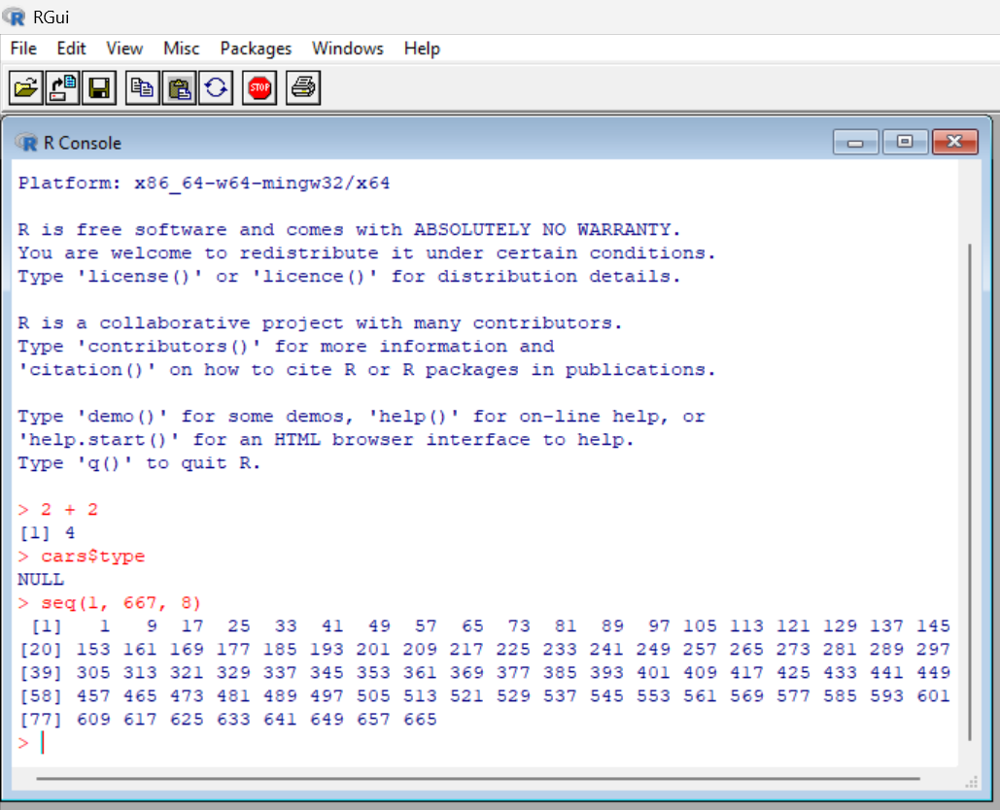
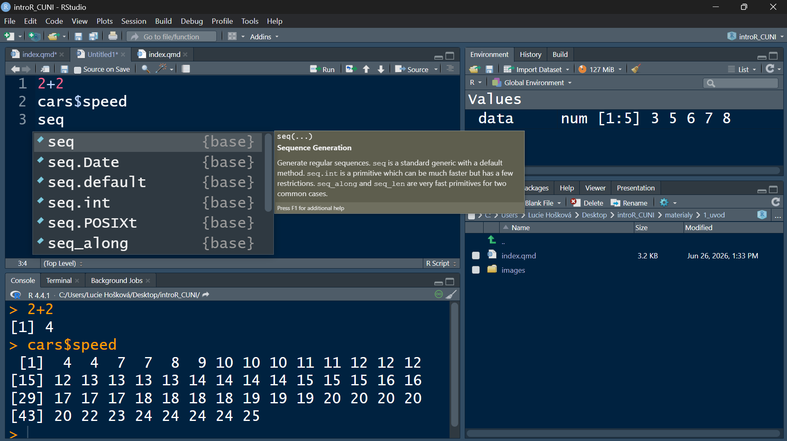
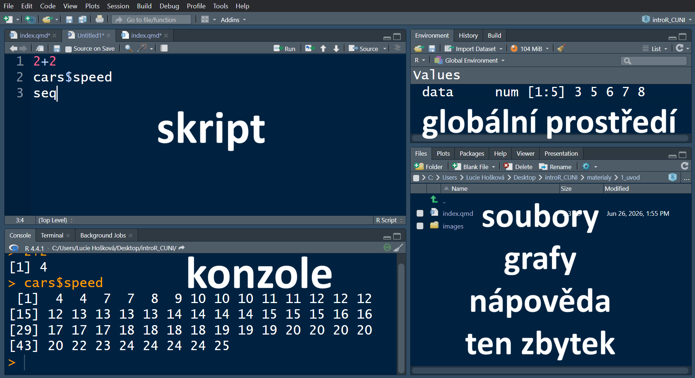

## Program

::: incremental
-   organizační a administrativní informace ke kurzu
-   krátké seznamovací okénko
-   seznámení se s prostředí IDE RStudio
-   R projekty, .Rfile a jak to vlastně celé funguje?
-   datové typy v R
-   operátory
-   ukládání dat do paměti
-   etiketa psaní kódu
:::

## O kurzu

-   kurz s cílem poskytnout účastníkům **solidní základy práce s R** za účelem následné práce s vědeckými daty

-   **zakončení mikrocerfikátem**: oficiální [certifikát uznávaný napříč EU](https://cczv.cuni.cz/CCZV-521.html) s jasně definovanými dovednostmi

-   pokračování: do budoucna jsou plánována **jednorázová školení na specifická pokročilá témata** o která bude zájem

## O vyučujícím

#### Mgr. Lucie Hošková

-   manažer repozitáře pro výzkumná data na UK

-   výuka R v rámci programu Charleston, Letní školy pro data stewardy, a akcí pod záštitou CpOS

-   datová práce všeho druhu

    -   datová analýza pro Akademii Věd

    -   konzultace pro dizertační, diplomové a bakalářské práce

    -   KPZ (kolega poslední záchrany)

-   popularizačně naučné přednášky nejen o datové analýze

## Organizace kurzu

-   **10 lekcí po třech hodinách**
    -   bloky 3 x cca 50 minut
    -   výuka jednou za dva týdny, přes Vánoce pauza
-   **3 tématické okruhy**
    -   zpracovávání dat
    -   vizualizace dat
    -   analýza dat

## Hodnocení kurzu

1.  **průběžné domácí úkoly**
2.  **miniprojekt přes Vánoce**
3.  **80% docházka**
    -   v případě nemoci/neschopnosti se účastnit prezenčně možnost připojení online, ale **prosím choďte pokud můžete**
    -   v případě absence či online výuky domácí práce navíc
    -   je to vše o domluvě :\]

## Průběh hodin

1.  úvodní opakování z předchozí hodiny

2.  výklad nové látky

    -   kombinace prezentace, code-along a samostatné práce

3.  cvičení z probrané látky

    -   kombinace nové látky a znalostí z předchozích hodin

4.  řešení "chuťovek" z minulých hodin a z dotazů

5.  zadání domácího úkolu

## Představovací kolečko

1.  jméno

2.  obor

3.  zkušenosti s programováním (potažmo R)

4.  zkušenosti se statistikou

5.  co se chcete naučit

## Programovací jazyk R

Open source programovací jazyk určený ke statistické analýze a datové vizualizaci.

-   v současnosti jeden ze standardů pro datovou analýzu ve vědecké sféře

-   aktivně využívaný, spravovaný a uržovaný globální vědeckou komunitou

    -   dlouhá historie: spuštěn v roce 1993

-   nepřeberné množství specializovaných rozšíření

## R vs RStudio

::: columns
::: {.column width="50%"}
R


:::

::: {.column width="50%"}
RStudio



-   IDE - vývojářské prostředí

-   usnadňuje práci s R
:::
:::

## RStudio



## Datové typy v R

::: columns
::: {.column width="33%"}
### Numeric

-   integer

    -   5, 0, 123

-   double

    -   1.87, 0.3679

    -   Inf

    -   -Inf
:::

::: {.column width="33%"}
### Character

-   "Hello world!"
-   "žluťoučký"
-   "532"
-   'kolo'
:::

::: {.column width="33%"}
### Logical

-   taktéž popisovány jako boolean

-   TRUE

-   FALSE
:::
:::

------------------------------------------------------------------------

### Další typy se kterými se můžete setkat

::: columns
::: {.column width="50%"}
NA

```{r}
vektor <- 1:4
vektor[5]
```

Complex

```{r}
as.complex(5.75 * sqrt(65))
```
:::

::: {.column width="50%"}
NULL

```{r}
radaCisel <- c(1, 2, NULL, 4)
radaCisel
```

NaN

```{r}
0 / 0
```
:::
:::

-   Přestože s komplexním číslem můžeme provádět aritmetické operace, R jej nebere jako numeric hodnotu!

-   NaN je naopak bráno jako numeric hodnota

## Operátory

### Matematické operátory

\+ - sčítání a odčítání

```{r}
5 + 7
8 - 2
```

**\*** násobení

```{r}
10 * 7
```

**/** dělení

```{r}
10 / 5
```

**%%** zbytek po dělení

```{r}
10 %% 7
10 %% 5
```

**%/%** dělení bez zbytku

```{r}
10 %/% 7
10 %/% 5
```

**\*\*** nebo **\^** umocnění

```{r}
5 ^ 2
5 ** 2
```

**\<= \>=** menší/větší nebo rovno

```{r}
8 >= 8
5699 <= 3456
```

------------------------------------------------------------------------

### Logické operátory

Logické operátory lze použít při výběru (vyber x NEBO y, x A y) či spojování podmínek, ale také umí vracet boolean hodnoty.

**&** a, taktéž, zároveň

```{r}
#zkontroluj, jestli plati oba vyrazy
34 > 44 & 56 > 8
34 < 44 & 56 > 8
```

**\|** nebo

```{r}
#je cislo nizsi nez 7 nebo vyssi nez 25
cislo <- c(13, 87, 2, 23)
(cislo < 7) | (cislo > 25)
```

**%in%** je v, nachází se v

```{r}
hodnoty <- c(12, 87, 55, 1098)
55 %in% hodnoty
345 %in% hodnoty
```

## Procvičení

```{webr}
#| exercise: ex_1
1 + 2 + 3 + ______
```

## Ukládání proměnných

ff

### Zakázané způsoby pojmenovávání proměnných

-   mezera mezi slovy

    ``` r
    pet aut <- 5
    ```

-   začínat symbolem

    ``` r
    <6>4aut <- 5
    ```

-   začínat číslicí

    ``` r
    5aut <- 5
    ```

**Pozor na diakritiku!**

------------------------------------------------------------------------

## Etiketa psaní kódu

**R je case sensitive!**

```{r}
identical("data", "Data")
```

::: columns
::: {.column width="50%"}
Používejte co chcete ale buďte konzistentní.

Který styl se vám používá nejsnadněji? U kterého děláte nejvíc chyb?

Jaké jsou zvysklosti ve vašem oboru/laboratoři?
:::

::: {.column width="50%"}
**Možné styly zápisu:**

-   camelCase

-   PascalCase

-   snake_case

-   kebab-dash

-   a jiné
:::
:::

------------------------------------------------------------------------

{fig-align="center"}

------------------------------------------------------------------------

### Poznámky

\# vše co je za hash symbolem počítač ignoruje

```{r}
2 + 1 + 3
2 + 1 # + 3
```

**Ctrl + Shift + C** po výběru více linek kódu je všechny přemění na komentář.

Pište si poznámky, ale zase to **nepřežeňte** - není to román.

```{r}
#VYPOCET PRUMERNE VYSKY 
#nahodny vyber ctyr reprezentatntu z kazde tridy
ctvrtaTrida <- c(154, 155, 143, 156)
pataTrida <- c(171, 158, 162, 144)
mean(c(ctvrtaTrida, pataTrida)) #prumerna vyska obou trid v cm
```

## RProjects

rovbou načte i setdw() a uložené proměnné takže se může rovnou pokračovat

je dobré si všechno držet pohromadě

co je Rfile RData a tak

relativní cesta k souborům takže jde celý projekt prostě jen zkopírovat a poslat, ale k tomu víc u ukládání dat
